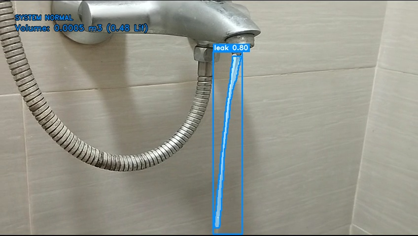
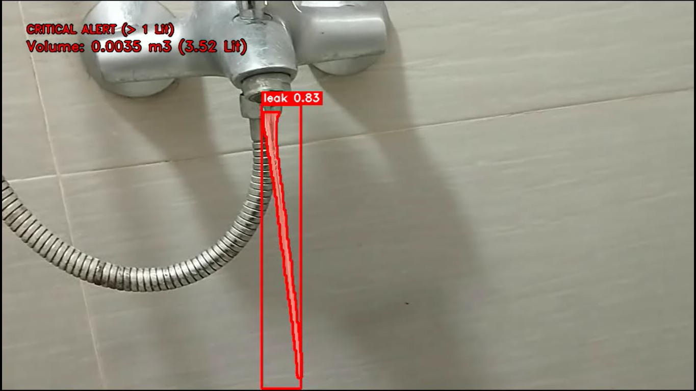

<h2 align="center">
  Author: Huynh Thanh Phong (ReoRioll)
</h2>

<p align="center">
   Computer Science of College of Information and Communication Technology of Can Tho University (Course 48)<br>
</p>

<p>

<b>Researchs:</b> Artificial Intelligence in Education - Mathematics in Deep Learning and Machine Learning<br>

<mark><b><b>Name Project:</b></b> </mark> Instance Segmentation and Dynamic Prediction for Water Leaks Using YOLO and Euler Integration. <br>

<mark><b><b>Link Data:</b></b> </mark> https://www.kaggle.com/datasets/reorioll/leakwater-data <br>

</p>
<p align="center">
   <b>Presional link Information</b>
</p>

<p>
&nbsp;&nbsp;&nbsp;&nbsp;&nbsp;&nbsp;&nbsp;&nbsp;&nbsp;&nbsp;&nbsp;&nbsp;&nbsp;&nbsp;&nbsp;&nbsp;&nbsp;&nbsp;
Facbook: https://www.facebook.com/huynh.thanh.phong.561667 <br>

&nbsp;&nbsp;&nbsp;&nbsp;&nbsp;&nbsp;&nbsp;&nbsp;&nbsp;&nbsp;&nbsp;&nbsp;&nbsp;&nbsp;&nbsp;&nbsp;&nbsp;&nbsp;
Kaggle: https://www.kaggle.com/reorioll <br>

&nbsp;&nbsp;&nbsp;&nbsp;&nbsp;&nbsp;&nbsp;&nbsp;&nbsp;&nbsp;&nbsp;&nbsp;&nbsp;&nbsp;&nbsp;&nbsp;&nbsp;&nbsp;
Youtobe: https://www.youtube.com/@ReoRioll-2304CICTCTU <br>
</p>
<br>


## Kết quả kiểm thử trên video giao thông thực tế
<p align="center">
  
  

  <br>
  <i>Đánh giá hệ thống nhận diện và cảnh báo mức độ rò rỉ của nước.</i>
</p>

```python
!git clone https://github.com/https://github.com/huynhthanhphong231004IT/Water_leak_detection_using_Instance_Segmentation_with_YOLO.git
```

```python
from Code.Value import Value as Val
from Code.Detection import WaterLeak_InstanceSegmentation
from Code.DetectionImage import WaterLeak_ImageSegmentation
if __name__ == "__main__":
    model_path = Val.PATH_MODEL

    # Dự đoán trên hình ảnh
    img_input_path = Val.PATH_INPUT_IMAGE
    img_output_path = Val.PATH_OUTPUT_IMAGE
    WaterLeak_ImageSegmentation.Predict(model_path, img_input_path, img_output_path)

    # Dự đoán trên video
    video_input_path = Val.PATH_INPUT_VIDEO
    video_output_path = Val.PATH_OUTPUT_VIDEO
    WaterLeak_InstanceSegmentation.Predict(model_path, video_input_path, video_output_path)

```
